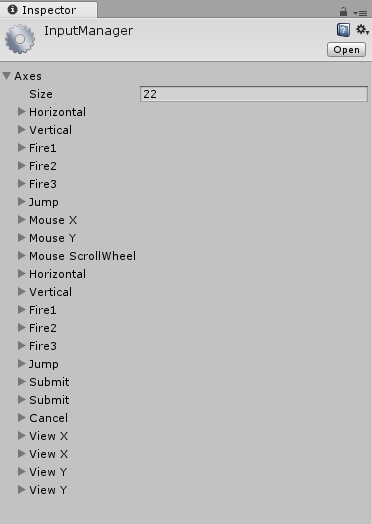
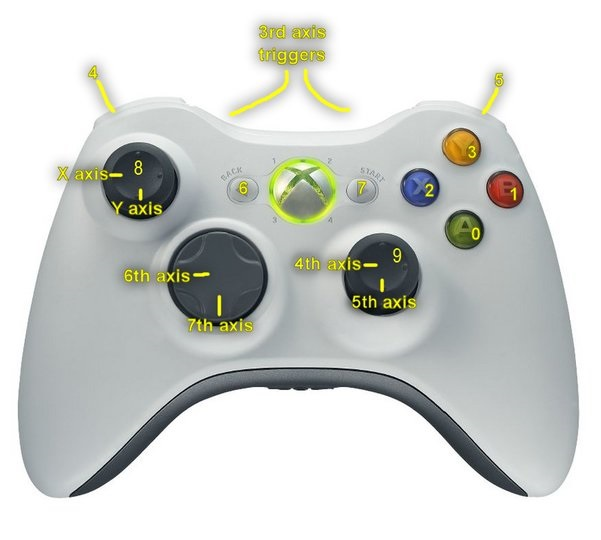
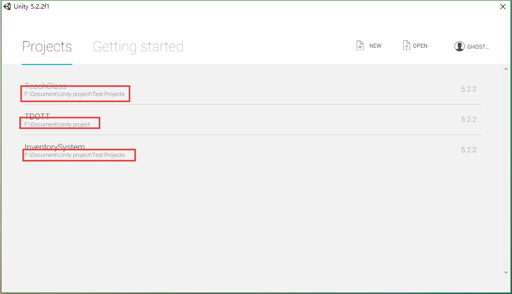
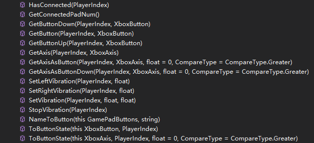
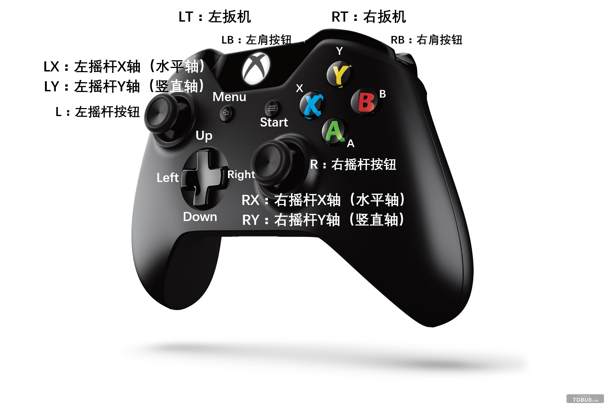

---
## 引言
在Unity中，对非移动平台输入的管理是通过InputManager来管理的，也就是UnityEngine自带的Input静态类来管理。而且在编辑器中提供了一个可视化的界面来管理。  
这个界面可以通过 ```Edit - Project Settings - Input```来打开。  
  
这套管理系统的使用方法不是本文重点暂且不表。  
我认为这套系统并不是很好用，对于键盘输出可以使用Input.GetKey[Down/Up]等API来实现，但是对于游戏控制器（手柄）来说，这一套系统并不是很好用。

## 关于XBOX架构的手柄适配
关于手柄适配，Unity原生的解决方案可以说只是勉强能用的状态，使用Axis输入轴的概念管理，每一个输入轴需要开发者手动定义，而且给出的意义不明确，譬如这样：  
  
这多达几十个轴并没有详细说明对应手柄上的某一个按键或者摇杆。需要开发者自己去查找相应资料。  
  
图片来源：[【xbox开发】unity3d xbox one手柄键位](http://www.voidcn.com/blog/egostudio/article/p-5979569.html)

而且奇葩的一点是，Unity中对左扳机和右扳机视为一个轴，左扳机的范围在(-1,0)，右扳机的范围在(0,1)。这样就使得如果你想要做一款使用左扳机瞄准右扳机射击的游戏操作，用这个基本就歇菜了。而且如果你想要添加震动…  
Unity5.6版本都没有提供官方的手柄震动API。

## XInputInterface.dll
当然，得益于脚本语言采用C#和Unity良好的可拓展性，要寻找第三方解决方案非常非常容易，在Assets Store中随便搜索一下输入插件就可以找到一大堆，如下图：
  

当然，这些大都是收费的，而我个人比较倾向于开源且免费的东西，于是我发现了XInputInterface这一个解决方案。这个东西是一个外国人做的C#控制XBOX手柄的封装链接库。里面将C++里的一些函数封装好了。github开源地址：[XInputDotNet - Github](https://github.com/speps/XInputDotNet)  

### 使用XInputInterface.dll
在使用之前，应该做的准备工作如下：

1.	首先将XInputInterface.dll放入Unity工程根目录中，（即下图红色框路径，根据你的项目而改变）
 
2.	在Asset目录下新建Plugins文件夹，将XInputInterface.dll放入其中。  
3.	如何在脚本中使用此插件  
    a)	在需要使用手柄输入的脚本中引入XInputDotNetPure命名空间  
    b)	在脚本中使用PlayerIndex枚举类型进行识别玩家索引  
    c)	使用GamePadState 识别事件状态  
    d)	使用GamePad. SetVibration开启震动  

### 几个简单的小示例

```csharp
//判断是否有手柄连接
public class InputController : MonoBehaviour 
{
    private PlayerIndex playerIndex;
    private GamePadState state;

    void Update()
    {
        state = GamePad.GetState(0);
        //使用state.IsConnected判断是否连接
    }
}

//判断按钮A是否按下
public class InputController : MonoBehaviour 
{
    private PlayerIndex playerIndex;
    private GamePadState state;

    void Update()
    {
        state = GamePad.GetState(0);
        //使用state.Buttons.A == ButtonState.Pressed判断是否按下
        //使用state.Buttons.A == ButtonState.Released判断是否抬起
        //使用state.Triggers.Left判断左扳机按下程度
        //使用GamePad.SetVibration(playerIndex, state.Triggers.Left, state.Triggers.Right);调动手柄左右两个震动马达	
    }
}

```

## 对XInputInterface的一点小改进
在Unity中，对输入的API是非常规范和严谨的。可是在XInputInterface中并没有遵守Unity这样的规则对方法进行命名和操作，例如没有GetKey、GetButtonDown之类的方法。  
而我更习惯Unity的那套命名方法，于是，我在XInputInterface的基础上加了一个静态类XInput来对该插件进行了一定的改进，并添加了一些新功能来适应Unity的使用习惯。  



详细说明如下：
```csharp
//Xbox按钮枚举
public enum XboxButton
{
    X,
    Y,
    A,
    B,
    Start,
    Menu,
    L,
    R,
    LB,
    RB,
    Up,
    Down,
    Left,
    Right
}
//XBox输入轴枚举
public enum XboxAxis
{
    LX,
    LY,
    RX,
    RY,
    LT,
    RT
}
//返回玩家手柄是否连接（最多支持4个玩家手柄连接）
bool HasConnected(PlayerIndex index);
//获取已连接的玩家（手柄）数
int GetConnectedPadNum();

//在按钮按下时刻返回true
bool GetButtonDown(PlayerIndex index, XboxButton button);
//在按钮按住的时刻返回true
bool GetButton(PlayerIndex index, XboxButton button);
//在按钮抬起的时候返回true
bool GetButtonUp(PlayerIndex index, XboxButton button);

//获取某一个轴的当前量
float GetAxis(PlayerIndex index, XboxAxis axis);
//对某一个轴采取按钮式响应，即通过自定义比较参数，在大于/小于/等于比较值的时候返回true
bool GetAxisAsButton(PlayerIndex index, XboxAxis axis, float cmpBase = 0, CompareType cmp = CompareType.Greater);
//对某一个轴采取按钮式响应，即通过自定义比较参数，在大于/小于/等于比较值的时候返回true
//与GetAxisAsButton不同的是此方法只会在达成比较时返回一次
bool GetAxisAsButtonDown(PlayerIndex index, XboxAxis axis, float cmpBase = 0, CompareType cmp = CompareType.Greater);

//设置左马达震动
void SetLeftVibration(PlayerIndex index, float strength);
//设置右马达震动
void SetRightVibration(PlayerIndex index, float strength);
//设置马达震动
void SetVibration(PlayerIndex index, float leftMotor, float rightMotor);
//停止所有马达的震动
void StopVibration(PlayerIndex index);

```
其中按钮与轴的对应关系如下图所示：  



这里只给出了XInput脚本的公共方法原型，具体此脚本可以[点击此处下载](../assets/downloadable/XInput.cs)。


