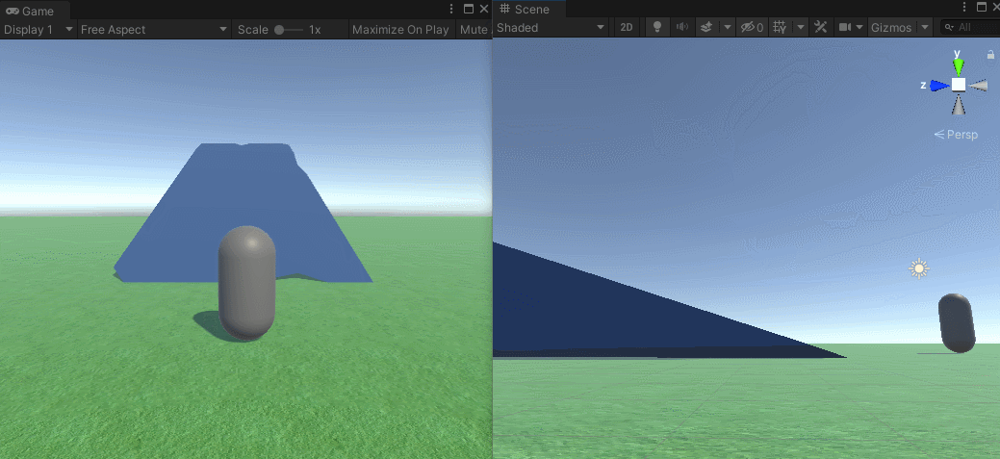
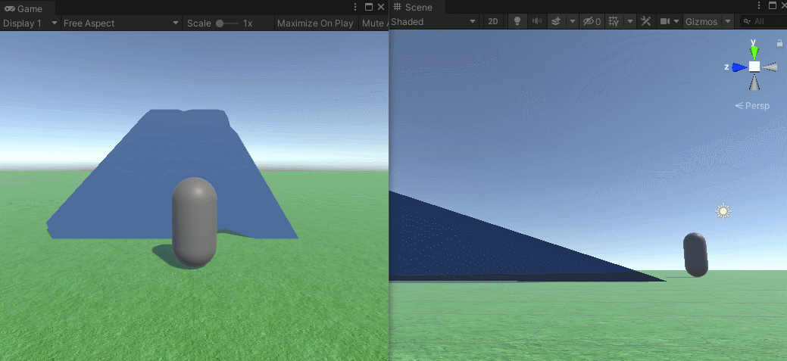
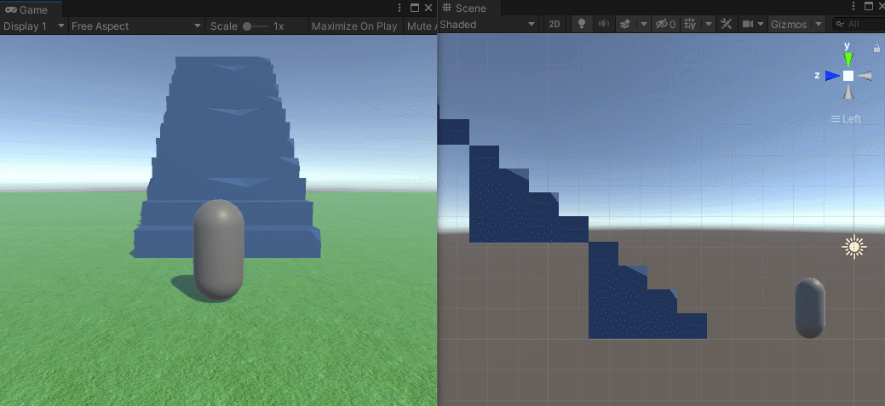
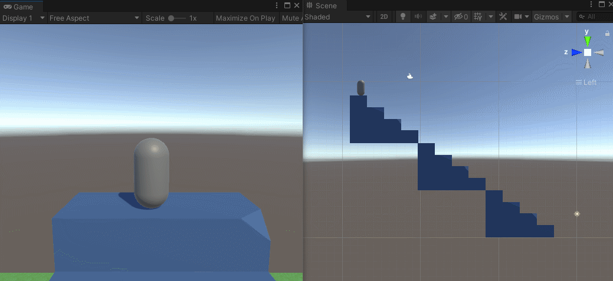
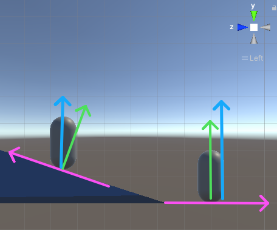
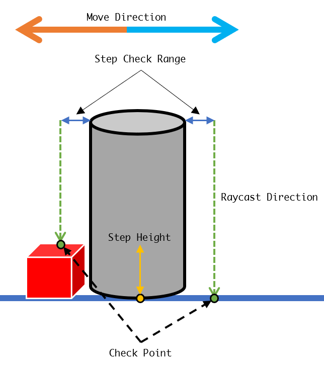

---
## 0x0. 引言
在第三人称游戏中，功能完善的游戏控制器对最终游戏的体验能有非常大的提升。在Unity游戏引擎中自带了一个叫做“<a href="https://docs.unity3d.com/2020.3/Documentation/Manual/class-CharacterController.html" target="blank">CharacterController</a>”的组件，该组件不需要添加额外的Rigidbody与Collider组件，实现了玩家控制的一些基本功能。一般情况下，该组件可以满足不同游戏的基础需求，该组件拥有可调节的斜坡自动上坡、最小移动距离与台阶偏移量等参数。  
本文将介绍一种使用Rigidbody与Collider组件的角色控制器中的斜坡与楼梯行走的处理办法。

## 0x1. 为什么要处理楼梯与斜坡？
对3D游戏中的角色控制器而言，最简单的处理方式就是在FixedUpdate中对Rigidbody进行移动，下面的代码演示了最简单的角色控制器的移动。
```csharp
public class Movement : MonoBehaviour
{
    public float moveSpeed = 10f;
    public Rigidbody rb = null;

    private Vector3 moveDelta = Vector3.zero;

    void Start()
    {
        rb = GetComponent<Rigidbody>();
    }

    void Update()
    {
        moveDelta.x = Input.GetAxis("Horizontal");
        moveDelta.z = Input.GetAxis("Vertical");

        Vector3 move = moveDelta * moveSpeed;
        move.y = rb.velocity.y;

        rb.velocity = move;
    }
}
```
这种移动方式在一些基本地形上行走勉勉强强可以使用，如下图所示。


但是该方式由于过于简陋，其弊端也非常明显，主要体现在以下几个方面：
- 当速度稍大的时候，斜坡的上下坡会变得非常糟糕
- 完全无法跨越台阶一类的障碍物，需要进行跳跃操作
- 下楼梯完完全全是一场灾难

具体的情况如下图所示。


速度稍快的时候，上坡停止时角色会不由自主的向上飞一段距离，而下坡的时候角色完全不是沿着斜坡向下走，而更像是“跳着下了斜坡”。


如果碰撞体没有做特殊处理，角色不仅无法在不跳跃的情况下上楼梯，更加对场景中地面上一些小型障碍物无法实现自动跨越。


下楼梯根本不是在下楼梯，反而像是在跳楼。

虽然说第三点在某些游戏中也并没有专门进行处理，当速度比较正常的时候这样的下楼梯方式在一定程度上也是可以接受的，但是这些情况说明了对角色的精细控制需要特别的对斜坡与楼梯（障碍物）进行特殊的处理。

## 0x2. 解决方案
要解决这个问题，首先要明白为什么会导致这个问题。  
对于斜坡问题，主要的原因是因为角色的移动方向导致的。这里的移动方向是由输入决定的，一般而言，输入是一个二维的输入，范围在[-1, 1]之间，对应游戏中的xoz平面的方向。这个方向在斜坡的上下坡时候与角色应当要移动的方向不匹配，主要是由于这个不匹配导致的问题。  
所以解决这个问题的思路就很清晰了，在斜坡上移动方向应该要匹配斜坡的角度。  
而楼梯问题，原因则是因为角色遇到这种非凸包的碰撞体，引擎的物理系统并不会把角色自动抬上去。所以解决楼梯问题的思路有两个，一个是把楼梯的碰撞体转化为凸包，这样这个问题又转换为斜坡问题，第二个思路就是手动把角色往楼梯上抬，完成这个物理系统不会自动完成的工作。

### 斜坡问题
对斜坡问题而言，首先需要解决的是，如何判断角色是否处于斜坡上。这个问题的其中一个答案如下：角色是否处于斜坡上取决于角色与角色当前所位于的平面的法线向量是否与世界方向的上方对应。



如上图所示，绿色箭头表示玩家所处平面的法线方向，蓝色箭头表示世界方向的上方，粉色箭头表示玩家所处的平面。

在Unity中实现如下：
```csharp
private bool IsSlope(Rigidbody rb)
{
    float slopeHeightMaxDistance = 2f;
    float heightOffset = 2f;

    RaycastHit hit;
    if (Physics.Raycast(rb.position + Vector3.up * heightOffset, Vector3.down, out hit, slopeHeightMaxDistance))
    {
        return hit.normal != Vector3.up;
    }

    return false;
}
```

可以判断是否处于斜坡后，第二个问题是获取斜坡的方向向量，也就是获取到上图中粉色箭头的方向，该方向的正反取决于玩家当前的移动方向，该方向的计算方法为玩家的移动方向在角色所处平面的投影方向。这里的移动方向是原始的，错误的那个移动方向，在Unity中可以直接使用`Vector3.ProjectOnPlane`这个API来计算。  
至此，解决方案已经出来了：**角色处于斜坡上时，移动方向更新为斜坡的方向，不在斜坡上时，移动方向为输入的移动方向。**  
使用该解决方案解决问题后，效果如下图所示。  


### 楼梯问题
楼梯问题在前文已经提出了解决方案，除去使用凸包碰撞体转为斜坡问题外，另外一种方案则是使用代码对角色进行自动抬起操作。  
该方案需要解决的第一个问题是如何判断楼梯的存在，这里给出一个思路：



最上方代表移动方向，图中表示了两种方向下的区别，当移动方向在角色前方时，给定一个检测范围，在这个范围外向下进行射线检测，如图中蓝色标识（范围）与绿色虚线箭头（射线检测方向）。计算检测到的交点（绿色点）与角色自身脚所在的点（黄色点）的高度差（黄色标识），当这个高度差大于某一设定阈值时，判定为遇到楼梯或者障碍物。  
明显看出，图中向左的时候会判定为遇到楼梯，向右走则不会判定为遇到楼梯。

使用Unity代码实现如下：
```csharp
private bool IsStep(out Vector3 point)
{
    Ray ray = new Ray(transform.position + MoveDirection.normalized * stepCheckRange + Vector3.up * stepCheckHeight, Vector3.down);
    RaycastHit hit;
    point = Vector3.zero;

    if (!isGrounded)
        return false;

    if (Physics.Raycast(ray, out hit, stepCheckHeight * 3, groundLayer))
    {
        float height = hit.point.y - rb.position.y;
        if (height < 0.06f)
            return false;

        if (height <= maxStepHeight)
        {
            point = hit.point;
            return true;
        }
    }
    return false;
}
```

判定完成之后，对角色进行抬起可以使用插值的方法进行，也可以使用Unity中Rigidbody里的“<a href="https://docs.unity3d.com/ScriptReference/Rigidbody.MovePosition.html" target="blank">MovePosition</a>”API。

使用该方式完成后效果如下：


## 0x3 尾巴
本文讨论了3D游戏中的角色控制器在斜坡与楼梯等情况下如何让操作手感更丝滑，给出了两个简易解决方案，值得说明的是，这几个解决方案都非常初级。在目前的主流游戏下，未必是使用的该方法，各位读者可以由此去深一步的思考，希望本文能够起到抛砖引玉的作用。

---