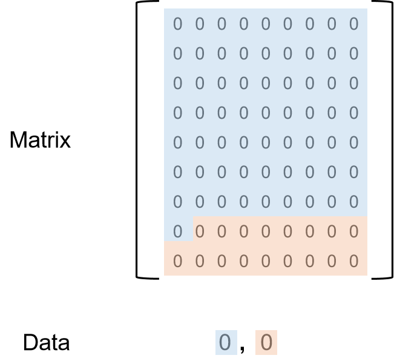

---
# 0x0. 情景
先说明什么是布尔矩阵：**值为bool或者仅包含01的二维矩阵**。
假定一个场景：现有一个840×840大小的瓦片地图，在服务端使用二维矩阵存储，如果直截了当开一个840×840的二维数组bool mapData\[840]\[840]，这样显然是有些蛋疼的。
这样暴力的方式显然不能够应用到生产环境中去，这里的例子还只是一个840大小的矩阵，如果更大到8400×8400那就更加无法应用了。

# 0x1. 原理
这里提出一种方式来存储这样的矩阵，其主要思想是使用二进制的优势，将独立的bool数据放到数字类型中的某一位去做，将整个矩阵按照行主序存储在一个一维数组中。
这里以一个9×9矩阵并且使用`int64_t`作为数据存储格式为例，则只需要一个长度为2的`int64_t`数组即可存下所有的数据，其数据分布如下：




其中第一位数表示了矩阵中的前64位数据，第二位数表示了矩阵中的后面所有数据。对于每一个数，则可以使用位掩码（bit-mask）方式来操作。
以9×9矩阵为例，使用二维数组需要**9×9×sizeof(bool) = 81bytes**数据，如果使用位运算压缩存储，则只需要**2×sizeof(uint64_t) = 16bytes**数据，其数据只有二维数组的**12.5%**。

# 0x2. 代码实现
```cpp
// BoolMatrix.hpp
#pragma once

#include <vector>
#include <tuple>
#include <cmath>

class BoolMatrix
{
public:
    BoolMatrix(int rowSize, int colSize, bool defaultVal = false)
        : row(rowSize), col(colSize)
    {
        if (row <= 0 || col <= 0)
            return;

        int size = ceil(row * col / 1.0 / MAX_BIT_COUNT);
        data = std::vector<int64_t>(size, defaultVal ? 1 : 0);
    }

    ~BoolMatrix() = default;

    // get matrix cell value
    bool Get(int x, int y)
    {
        if (x < 0 || x >= row || y < 0 || y >= col)        
            throw "index out of range!";
        
        int idx, bit;
        std::tie(idx, bit) = GetIndexAndBit(x, y);
        auto val = 1 & (data[idx] >> bit);
        return val != 0;
    }

    // set matrix cell value to true
    void Set(int x, int y)
    {
        if (x < 0 || x >= row || y < 0 || y >= col)
            throw "index out of range!";

        int idx, bit;
        std::tie(idx, bit) = GetIndexAndBit(x, y);
        data[idx] = data[idx] | (1ll << bit);
    }

    // set matrix cell value to false
    void Unset(int x, int y)
    {
        if (x < 0 || x >= row || y < 0 || y >= col)
            throw "index out of range!";
        
        int idx, bit;
        std::tie(idx, bit) = GetIndexAndBit(x, y);
        data[idx] = data[idx] & ~(1ll << bit);
    }

    // flip matrix cell value
    void Flip(int x, int y)
    {
        if (x < 0 || x >= row || y < 0 || y >= col)
            throw "index out of range!";

        int idx, bit;
        std::tie(idx, bit) = GetIndexAndBit(x, y);
        data[idx] = data[idx] ^ (1ll << bit);
    }

    // unfold matrix
    std::vector<std::vector<bool>> GetMatrix()
    {
        std::vector<std::vector<bool>> mat{};
        
        for (size_t x = 0; x < row; ++x)
        {
            std::vector<bool> rowData{};
            for (size_t y = 0; y < col; ++y)
            {
                rowData.push_back(Get(x, y));
            }
            mat.push_back(rowData);
        }

        return mat;
    }

private:
    int row = 0;
    int col = 0;

    std::vector<int64_t> data{};

    const int MAX_BIT_COUNT = 64;

private:
    std::tuple<int, int> GetIndexAndBit(int x, int y)
    {
        int coord = x * col + y;
        int index = coord / MAX_BIT_COUNT;
        return std::make_tuple(index, coord - index * MAX_BIT_COUNT);
    }

};
```