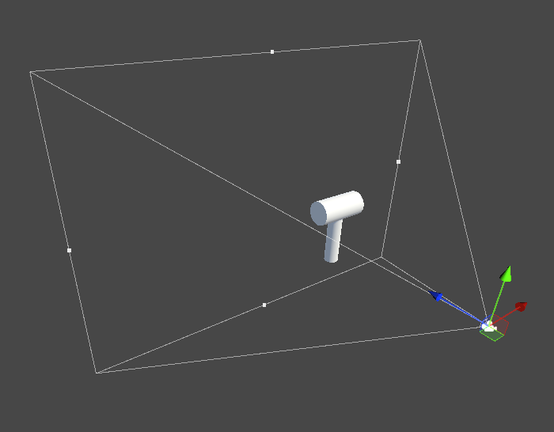
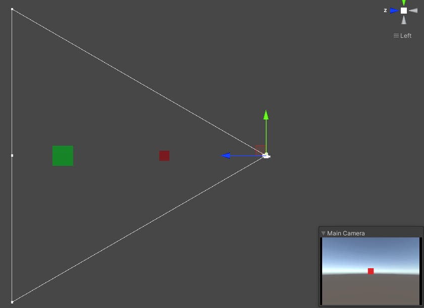
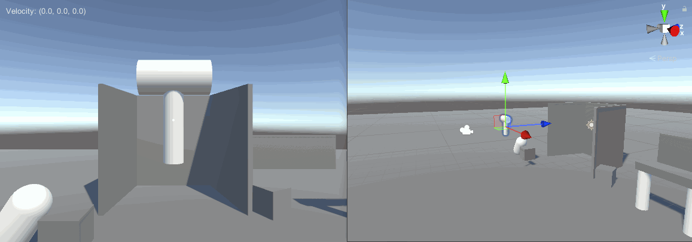

---
## 0x0. 前言
在steam上有一款名为<a href="https://store.steampowered.com/app/1049410/_Superliminal/" target="blank">超阈限空间 Superliminal</a>的游戏，该游戏的一个核心玩法便是利用物体的视差来解密，如下图所示：

其主要的效果是玩家可以提起一个场景中的物体进行移动（包括视角移动和摄像机的移动），这个物体在玩家的视野中大小是不变的，但是在游戏场景中的大小却发生了变化。
本文尝试使用Unity引擎复刻这一效果。

## 0x1. 原理
这一视差效果的原理非常简单，众所周知，3D游戏中的相机一般都是透视相机，该相机的的可视范围被视锥体描述。当物体出现在视锥体中的时候被会被渲染到屏幕上。示意图如下：

通过简易分析可知，物体改变其自身大小的条件是摄像机与该物体之间的距离发生变化。而在透视相机中，距离发生变化会产生”近大远小“的效果而使得物体在视野中的大小发生变化。如果想要在透视相机中去掉近大远小这一效果，则只需要对物体进行等比缩放即可。
如下图所示，白色线框表示相机视锥体的侧视图，其视野内有红、绿两个物体，两个物体的大小明显不一样，但是此时这两个物体在相机视野中的大小却刚好一致。

这是一个相似问题，假如物体的大小为`S0`，此时距离相机的距离为`D0`，当它**沿着摄像机与其中心的方向**移动到距离为`D1`的时候大小为`S1`，此时根据相似原理，有`S0/S1 = D0/D1`，在上文的游戏中，玩家拾起物体的时候可以得出`S0`和`D0`，物体移动后可得`D1`，则可以求得要保持在视野中大小不变，物体自身大小`S1=S0*D1/D0`。

## 0x2. 代码实现
根据以上原理，可以写出核心代码如下：
```csharp
void BeginScale(Transform target, Vector3 camPosition)
{
    _rawScale = target.localScale;
    _rawDistance = Vector3.Distance(target.position, camPosition);
}

void SetScale(Transform target, Vector3 camPosition)
{
    float curDistance = Vector3.Distance(target.position, camPosition);
    target.localScale = _rawScale * curDistance / _rawDistance;
}
```

## 0x3. 效果演示

上图中左侧是游戏画面，右侧是场景中实际发生的变化。

## 0x4. 尾巴
本文只探讨了该游戏中的缩放功能的实现，通过演示可以看出在没有关闭阴影的情况下，物体大小变化还是很容易穿帮的。同时，游戏中的大小变化是通过玩家的拾取行为实现的，要复刻完整的效果估计还需要使用某种方式（例如射线检测）将物体移动到沿着摄像机与物体方向能移动到的最远处。由于移动的物体可以是任意模型，还需要考虑模型穿模的问题，这又是另一个需要考虑的点，之后我会将这一效果也复刻出来并且分享到我的博客中。
