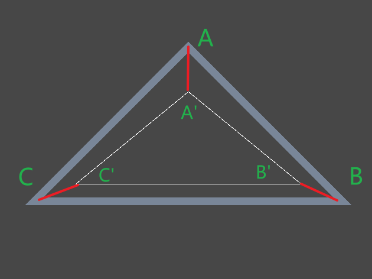
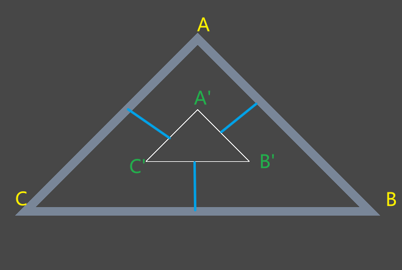
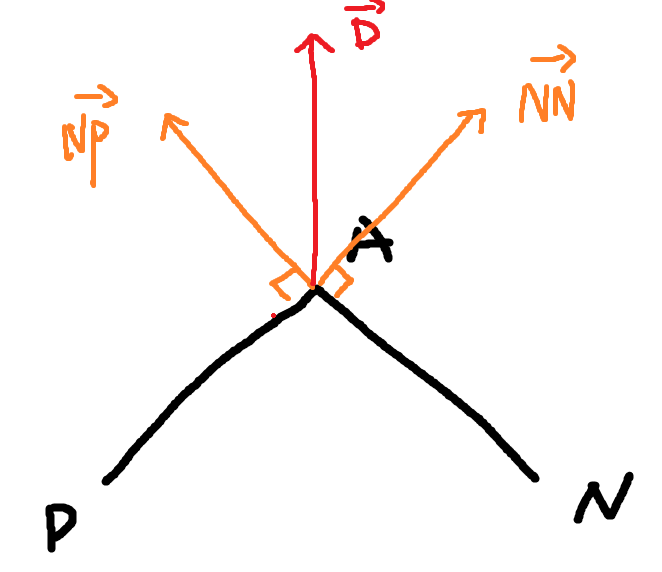
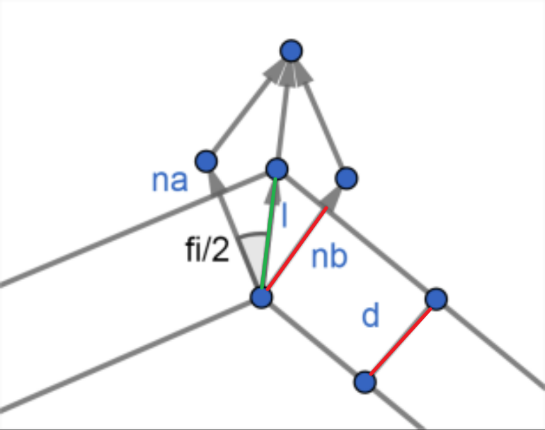
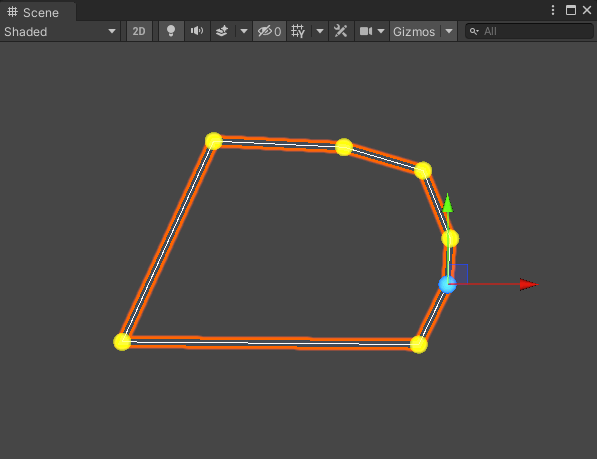

---

## 0x0. 问题
假定存在一个多边形（不论凹凸），先需要对这个多边形进行缩放以生成新的多边形，这里的缩放分为两种情形：
- 缩放后，新多边形的所有顶点与原顶点的距离一致，如以下情况

多边形ABC与缩放后的多边形A'B'C'保持了|AA'| = |BB'| = |CC'|
- 缩放后，新多边形的轮廓与原轮廓距离一致，如下图所示，这种情况称为等距缩放。


## 0x1. 实现
在说明实现之前，先给定多边形的定义，多边形（Polygon）由一系列2D平面上的点组成，这些点首尾相连组成的封闭图形称为多边形。
`Polygon(A) = { PointA, PointB, ... }`
对于多边形中的某一点`A`，需要计算其缩放距离`d`之后的新位置`A'`，缩放后的距离只要求出移动的方向与移动距离即可算出`A'`的位置。
对于缩放方向，考虑其相邻的两个点`P`和`N`，计算其法线`NN`和`NP`，则缩放的方向即为`Normalize(NN + NP)`。

对于单位二维向量`(x, y)`，法线易求得为`x + y = 0`，取决于方向，法线向量可以为`(-y, x)`或者`(y, -x)`。
若求顶点距离一致的缩放多边形，则新顶点位置为`A' = Normalize(NN + NP) * d`，其代码实现如下：
```csharp
Vector2[] Expand(Vector2[] points, float offset)
{
    int count = points.Length;
    Vector2[] result = new Vector2[count];
    
    for (int cur = 0; cur < count; ++cur)
    {
        int prev = (cur + count - 1) % count;
        int next = (cur + 1) % count;
        // 下一邻接点的法线
        Vector2 pNext = (points[next] - points[cur]).normalized;
        Vector2 nextNormal = new Vector2(-pNext.y, pNext.x);
        // 上一邻接点法线
        Vector2 pPrev = (points[cur] - points[prev]).normalized;
        Vector2 prevNormal = new Vector2(-pPrev.y, pPrev.x);
        
        // 等分线
        Vector2 bis = (nextNormal + prevNormal).normalized;
        // 顶点距离一致
        result[cur] = points[cur] + bis * offset;
    }
    
    return result;
}
```

若要求等距缩放，则计算会复杂一些，如下图所示

已知红色部分长度相同，均为缩放距离`d`，`na`与`nb`为点A与其邻接点的法线，缩放方向仍然为上述计算得出的方向，只是距离变成了途中绿色部分长度`l`，法线间夹角为`fi`，则显然有
`cos(fi/2) = d/l`，
根据半角公式，有
`sqrt((1+cos(fi)) / 2) = d / l`，
由于`na`与`nb`均为方向向量，有
`cos(fi) = dot(na, nb)`，
代入上式得
`l = d / sqrt((1 + dot(na, nb)) / 2)`
则新点`A' = A + bis * l`，其代码实现如下：
```csharp
Vector2[] Expand(Vector2[] points, float offset)
{
    int count = points.Length;
    Vector2[] result = new Vector2[count];
    
    for (int cur = 0; cur < count; ++cur)
    {
        int prev = (cur + count - 1) % count;
        int next = (cur + 1) % count;
        // 下一邻接点的法线
        Vector2 pNext = (points[next] - points[cur]).normalized;
        Vector2 nextNormal = new Vector2(-pNext.y, pNext.x);
        // 上一邻接点法线
        Vector2 pPrev = (points[cur] - points[prev]).normalized;
        Vector2 prevNormal = new Vector2(-pPrev.y, pPrev.x);
        
        // 等分线
        Vector2 bis = (nextNormal + prevNormal).normalized;        
        // 等距缩放距离
        float len = offset / Mathf.Sqrt((1 + Vector2.Dot(nextNormal, prevNormal)) / 2f);
        result[cur] = points[cur] + bis * len;
    }
    
    return result;
}
```

## 0x2. 效果


