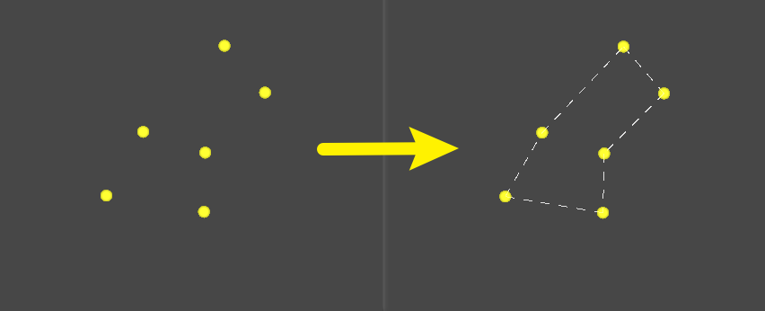
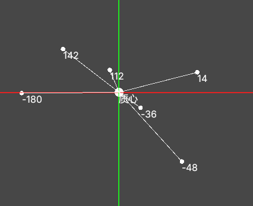
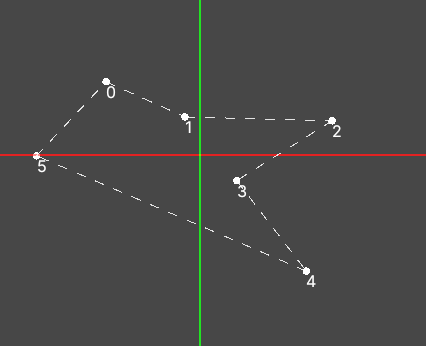
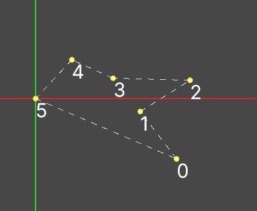

---
## 0x0. 问题
给定一些离散的点，需要对这些点进行排序，按照顺时针或者逆时针的顺序返回这些点，这样便可以通过排序后的点绘制出一个封闭图形。


## 0x1. 实现
这里给出两种方案：
### 方案一
先求出所有离散点的质心位置，之后以该质心位置为原点建立坐标轴，计算出每一个点与坐标轴水平方向的夹角，按照夹角排序即可。如果夹角一致则可以通过距离进一步比较。

如图所示，点上显示的数字表示该点与X轴正向的夹角，排序规则按照夹角大小即可。排序结果如下：

该方案代码如下：
```cpp
void ClockSort(std::vector<Vector2>& points, bool isCW = true)
{
    Vector2 center { 0, 0 };
    for (auto point : points)
    {
        center += point;
    }
    center /= points.size();
    
    sort(points, (Vector2& lhs, Vector2& rhs)
    {
        Vector2 l = lhs - center;
        Vector2 r = rhs - center;
        
        float lAngle = atan2(l.y, l.x);
        float rAngle = atan2(r.y, r.x);
        // 未仔细考虑共线情况
        return isCw ? lAngle < rAngle : lAngle > rAngle;     
    });
}
```

### 方案二
不求质心，直接使用离散点中x值最小的点当作新坐标轴的原点，计算点`P`和点`Q`在该坐标轴下与原点形成的向量积的正负，当结果为正时，说明`P`在`Q`的顺时针方向，否则为逆时针方向，同样的，当其共线时按照其模长排序，排序结果如下：

该方案代码如下：
```cpp
void ClockSort(std::vector<Vector2>& points, bool isCW = true)
{
    Vector2 minPoint { FLOAT_MAX, FLOAT_MAX };
    for (auto point : points)
    {
        if (point.x < minPoint.x)
            minPoint = point;        
    }    
    
    sort(points, (Vector2& lhs, Vector2& rhs)
    {
        Vector2 l = lhs - minPoint;
        Vector2 r = rhs - minPoint;
        
        float cross = (l.x * r.y) - (r.x * l.y);
        return isCW ? cross < 0 : cross > 0; 
    });
}
```
**注：此方法不用最小点使用中心点一样可行。**

参考文献：<a href="https://www.cnblogs.com/dwdxdy/p/3230156.html" target="blank">【计算几何】多边形点集排序</a>