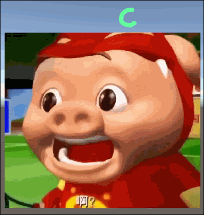

---
## 0x0. 原理

本质上与之前的[弹道效果文章](https://ghostyii.com/Unity-3D-Shootmark/)原理一致，均为**贴图融合**。
使用一张sprite当作橡皮，用其不透明的部分去消除掉另一个sprite内的像素颜色。
注意事项：橡皮sprite和被擦除的sprite都需要开启`Read/Write Enabled`。

## 0x1. 效果



## 0x2. 代码

```csharp
using UnityEngine;

[RequireComponent(typeof(SpriteRenderer))]
public class SpriteEraser : MonoBehaviour
{
    public SpriteRenderer brush;
    private Sprite _sprite = null;

    private void Start()
    {
        _sprite = GetComponent<SpriteRenderer>().sprite;
    }

    private void Update()
    {
        if (!brush || !_sprite)
            return;

        RefreshSprite();
    }

    private void RefreshSprite()
    {
        Vector3[] corners = GetSpriteCorners(brush);

        Vector2 uv = TextureSpaceUV(corners[3]);
        Vector2 texcoord = TextureSpaceCoord(corners[2]);

        for (int x = 0; x < brush.sprite.texture.width; ++x)
        {
            for (int y = 0; y < brush.sprite.texture.height; ++y)
            {               
                int w = (int)(texcoord.x + x);
                int h = (int)(texcoord.y + y);

                if (w < 0 || h < 0 || w >= _sprite.texture.width || h >= _sprite.texture.height)
                    continue;

                if (brush.sprite.texture.GetPixel(x, y).a > 0)
                    _sprite.texture.SetPixel(w, h, Color.clear);
            }
        }

        _sprite.texture.Apply();
    }

    public static Vector3[] GetSpriteCorners(SpriteRenderer renderer)
    {
        Vector3 topRight = renderer.transform.TransformPoint(renderer.sprite.bounds.max);
        Vector3 bottomRight = renderer.transform.TransformPoint(new Vector3(renderer.sprite.bounds.max.x, renderer.sprite.bounds.min.y, 0));
        Vector3 bottomLeft = renderer.transform.TransformPoint(renderer.sprite.bounds.min);
        Vector3 topLeft = renderer.transform.TransformPoint(new Vector3(renderer.sprite.bounds.min.x, renderer.sprite.bounds.max.y, 0));
        return new Vector3[] { topRight, bottomRight, bottomLeft, topLeft };
    }

    public Vector2 TextureSpaceCoord(Vector3 worldPos)
    {
        float ppu = _sprite.pixelsPerUnit;

        // Local position on the sprite in pixels.
        Vector2 localPos = transform.InverseTransformPoint(worldPos) * ppu;

        // When the sprite is part of an atlas, the rect defines its offset on the texture.
        // When the sprite is not part of an atlas, the rect is the same as the texture (x = 0, y = 0, width = tex.width, ...)
        var texSpacePivot = new Vector2(_sprite.rect.x, _sprite.rect.y) + _sprite.pivot;
        Vector2 texSpaceCoord = texSpacePivot + localPos;

        return texSpaceCoord;
    }

//     public Vector2 TextureSpaceUV(Vector3 worldPos)
//     {
//         Texture2D tex = _sprite.texture;
//         Vector2 texSpaceCoord = TextureSpaceCoord(worldPos);
//         // Pixels to UV(0-1) conversion.
//         Vector2 uvs = texSpaceCoord;
//         uvs.x /= tex.width;
//         uvs.y /= tex.height;
//         return uvs;
//     }
}
```