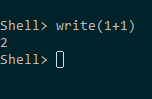
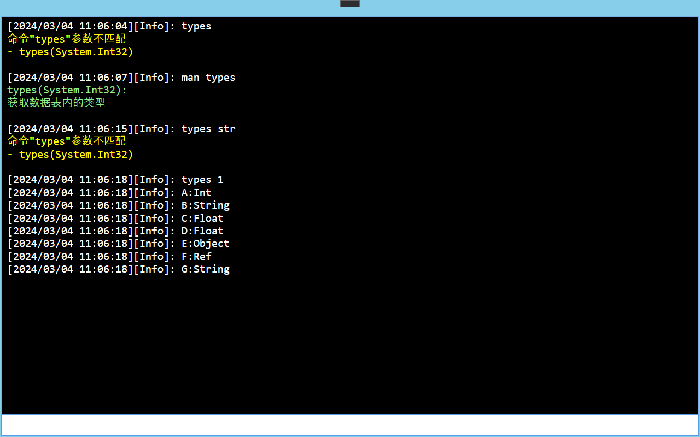

---

## 0x0. 前言
所谓的指令系统，是指在项目中可以通过某种渠道方便的来操作项目中的参数与功能的系统。在游戏项目中一般将这个指令系统称为GM系统，用于方便开发者与测试人员快速验证与迭代功能。
得益于CSharp语言方便的反射功能，可以在CSharp中快速的搭建一个简易指令系统。
本文分享其中的一种实现方法。

## 0x1. 原理
首先明确需求，指令系统接受一些指定的命令与参数，根据不同的命令与参数来执行对应的代码以达到某些目的。最常见的形式便是控制台，如下图所示。

要实现这样的功能，需要有一个指令管理器来加载所有支持的指令，同时在系统中最好能够方便开发者拓展新的指令。一些编程语言特性（如重载）等最好也能支持。同时，指令系统一般会有几个默认的指令，如`help`，`man`等。
在编程语言支持`反射`机制的前提下，其主要原理就成了**通过指令管理器支持的指令，以某种规则去调用不同模块/类中的对应函数/方法**。

## 0x2. 实现
为了方便快速拓展新的指令，首先定义一个特性`CMDAttribute`来指定指令的一些通用参数。
```csharp
[AttributeUsage(AttributeTargets.Method, AllowMultiple = true)]
internal class CMDAttribute : Attribute
{
    public string Name { get; private set; }
    public string Desc { get; private set; }

    public CMDAttribute()
    {
    }

    public CMDAttribute(string name, string desc = "")
    {
        Name = name;
        Desc = desc;
    }
}

```
这里的通用参数暂且定为命令名称和帮助信息。
之后定义一个通用的用于管理所有指令的管理类，这个管理类包括初始化所有指令、新注册指令、指令解析和调用等功能。大体上，此管理类结构如下：
```csharp
public static class Commands
{
    // abstract concept Terminal to output message    
    public static Terminal Terminal { get; set; }
    // record all commands
    private static Dictionary<string, HashSet<CommandInfo>> _cmds = new Dictionary<string, HashSet<CommandInfo>>();

    #region Framework

    public static void InitialCommandByType(params Type[] type)
    {            
        foreach (var t in type)
        {
            RegisterAllCommandByType(t);
        }
    }
    public static void InitialCommandByObject<T>(params T[] obj)
    {
        foreach (var o in obj)
        {
            RegisterAllCommandByObject(o);
        }
    }

    public static void RegisterCommand(string name, object invokeObj, MethodInfo method)
    {        
    }
    
    public static void Execute(string name, params object[] args)
    {        
    }

    public static void RegisterAllCommandByType(Type type)
    {        
    }
    public static void RegisterAllCommandByObject(object obj)
    {        
    }
    
    // output help message
    private static void TipMethodParams(string name)
    {
    }

    #endregion

    #region build-in commands

    // support multi-attribute in one method
    [CMD("help", "show help infomation"), CMD("man", "show help infomation")]
    private static void Help(string cmdName)
    {
        if (!_cmds.ContainsKey(cmdName.ToLower()))
        {
            Terminal?.PrintError($"unregister command \"{cmdName}\"");
            return;
        }

        cmdName = cmdName.Trim().ToLower();
        StringBuilder sb = new StringBuilder();

        foreach (var cmd in _cmds[cmdName])
        {
            sb.AppendFormat("{0}(", cmdName);
            bool isFirst = true;
            foreach (var parameter in cmd.method.GetParameters())
            {
                sb.Append(parameter.ParameterType);
                if (!isFirst)
                {
                    sb.Append(",");
                    isFirst = false;
                }
            }
            sb.AppendFormat("):\n{0}\n", cmd.method.GetCustomAttributes<CMDAttribute>().ToArray()[0].Desc);
        }

        Terminal?.Print(sb.ToString(), Color.LightGreen);
    }

    [CMD("cls", "clear the screen"), CMD("clear", "clear the screen")]
    private static void Cls()
    {
        Terminal?.Clear();
    }

    #endregion        
}
```
其中使用一个字典来保存所有已注册的指令，为了支持指令的重载，将同一名字的指令内注册的函数保存为一个哈希表以防止重复，内置4个指令`help`、`man`、`cls`、`clear`，这4个指令其实只包含了两项功能，也就是说该框架也支持不同名字的指令执行同一函数。
那么对于一个指令而言，需要保存什么？能不能保存一个委托呢？理论上来说，保存一个委托是可以的，但是问题是如何支持任意类型的方法呢？程序中不可能把所有类型的方法都声明一个委托。所以这里的`CommandInfo`应该至少保存两个数据用于执行指令，其定义如下：
```csharp
class CommandInfo
{
    public object obj;
    public MethodInfo method;
}
```
其中的`method`保存了指令执行时应该调用的方法，而`object`则定义了执行该方法的对象。
既然已经明确了指令的保存方式，那么注册指令函数则比较简单，往容器中放值即可。
```csharp
public static void RegisterCommand(string name, object invokeObj, MethodInfo method)
{
    if (string.IsNullOrEmpty(name))
        return;

    // use hashset to avoid repeat register
    if (!_cmds.ContainsKey(name))
        _cmds[name] = new HashSet<CommandInfo>();

    _cmds[name].Add(new CommandInfo() { obj = invokeObj, method = method });
}
```
要注册指令，除了可以使用`RegisterCommand`函数来注册单个指令外，也可以使用`RegisterAllCommandByType`和`RegisterAllCommandByObject`来批量注册指令，这两个方法的实现本质上是一致的，唯一的区别是，当传入的是实例化的对象的时候，会反射出所有带`CMD`标记的函数，而只有类型的时候，只会去反射其内部的静态函数。
这两个方法的实现如下：
```csharp
public static void RegisterAllCommandByType(Type type)
{
    // type commands only get static methods
    var methods = type.GetMethods
                  (                              
                      BindingFlags.Static |
                      BindingFlags.Public |
                      BindingFlags.NonPublic
                  );
    foreach (var method in methods)
    {
        foreach (CMDAttribute cmdAttr in method.GetCustomAttributes<CMDAttribute>())
        {
            // if not set name, use method name
            if (string.IsNullOrEmpty(cmdAttr.Name))
                RegisterCommand(method.Name.Trim().ToLower(), null, method);
            else
                RegisterCommand(cmdAttr.Name.Trim().ToLower(), null, method);
        }
    }
}
public static void RegisterAllCommandByObject(object obj)
{
    if (obj == null)
        return;

    var methods = obj.GetType().GetMethods
                  (
                      BindingFlags.Instance |
                      BindingFlags.InvokeMethod |
                      BindingFlags.Static |
                      BindingFlags.Public |
                      BindingFlags.NonPublic
                  );
    foreach (var method in methods)
    {
        foreach (CMDAttribute cmdAttr in method.GetCustomAttributes<CMDAttribute>())
        {
            // if not set name, use method name
            if (string.IsNullOrEmpty(cmdAttr.Name))
                RegisterCommand(method.Name.Trim().ToLower(), obj, method);
            else
                RegisterCommand(cmdAttr.Name.Trim().ToLower(), obj, method);
        }
    }
}
```
而对于`Execute`方法，则主要是去查找已经注册的指令中与指定的指令是否有参数一致的调用，如果有则使用执行该指令，其实现如下：
```csharp
public static void Execute(string name, params object[] args)
{
    if (!_cmds.ContainsKey(name.ToLower()))
    {
        Terminal?.PrintError($"unregister \"{name}\"");
        return;
    }

    name = name.Trim().ToLower();

    foreach (var cmd in _cmds[name])
    {
        var parameters = cmd.method.GetParameters();
        if (parameters.Length != args.Length)
            continue;

        bool isMatch = true;                

        for (int i = 0; i < parameters.Length; i++)
        {                    
            if (parameters[i].ParameterType != args[i].GetType())
            {
                isMatch = false;
                break;
            }
        }

        if (!isMatch)
            continue;

        try { cmd.method.Invoke(cmd.obj, args); }
        catch (Exception e) { Terminal?.PrintError(e.Message); }
        
        // execute over, method over
        return;
    }

    // if dont find any registered command, output the help message
    TipMethodParams(name);
}
```
值得注意的是，如果使用控制台输入指令和参数，则所有参数在传递的时候由于不知道类型都会用`string`来表示类型， 如果指令的参数并非全是字符串而是包含了一些数字，则可以通过简单的分析来匹配参数类型，这里提供一种方法：
```csharp
public static void Execute(string name, string[] args)
{
    if (!_cmds.ContainsKey(name.ToLower()))
    {
        Terminal?.PrintError($"unregistered command \"{name}\"");
        return;
    }

    // use lower letter for all commands
    name = name.Trim().ToLower();

    foreach (var cmd in _cmds[name])
    {
        var parameters = cmd.method.GetParameters();
        if (parameters.Length != args.Length)
            continue;

        bool isMatch = true;
        object[] argsWithType = new object[args.Length];

        // support int/float/string type parameters
        for (int i = 0; i < parameters.Length; i++)
        {
            if (parameters[i].ParameterType == typeof(int) && int.TryParse(args[i], out int intRes))
                argsWithType[i] = intRes;
            else if (parameters[i].ParameterType == typeof(float) && float.TryParse(args[i], out float floatRes))
                argsWithType[i] = floatRes;
            else
                argsWithType[i] = args[i];

            if (parameters[i].ParameterType != argsWithType[i].GetType())
            {
                isMatch = false;
                break;
            }
        }

        if (!isMatch)
            continue;

        try { cmd.method.Invoke(cmd.obj, argsWithType); }
        catch (Exception e) { Terminal?.AppendRaw(e.Message, TerminalControl.LogType.Error.ToBrush()); }

        return;

    }

    // if dont find any registered command, output the help message
    TipMethodParams(name);
}
```
这种方法可以支持一些简单的情况，但不能够覆盖所有情况，如一个指令所对应的方法有以下两种：
```csharp
[CMD]
void Call(int intVal) { }
[CMD]
void Call(string strVal) { }
```
在控制台输入`call 8`而想将参数8视为字符串时则无法识别。想要实现精细的重载，或许可以从已有的Console系统中获取灵感，例如使用`-XX`来强制指定类型或者使用引号来标识字符串等等。这属于更加细节的内容，本文只介绍一个简易框架，如读者有需要可以按需自行拓展。
对于内置的指令`help/man`，需要支持一个帮助功能，好在`CMD`特性中已经包含了帮助信息，只需要去找到这个信息并输出即可。其实现如下：
```csharp
private static void TipMethodParams(string name)
{
    if (!_cmds.ContainsKey(name))
        return;

    StringBuilder sb = new StringBuilder();
    sb.AppendLine($"command \"{name}\" parameters doesnt match");

    // output all commands' help message that named 'name'
    foreach (var cmd in _cmds[name])
    {
        sb.AppendFormat("- {0}(", name);

        for (int i = 0; i < cmd.method.GetParameters().Length; i++)
        {
            Type type = cmd.method.GetParameters()[i].ParameterType;
            sb.Append(type);

            if (i != cmd.method.GetParameters().Length - 1)
                sb.Append(", ");
        }
        sb.Append(")\n");
    }

    Terminal?.PrintWarning(sb.ToString());
}
```
至此，这一简易框架就完成了。由于框架脚本中拥有内置指令，这些指令需要在初始化的时候被注册，可以定义一个静态构造函数将自身指令先行注册，如下所示：
```csharp
static Commands()
{
    RegisterAllCommandByType(typeof(Commands));
}
```

## 0x3. 效果
在自制控制台下，可以实现以下简易效果：

