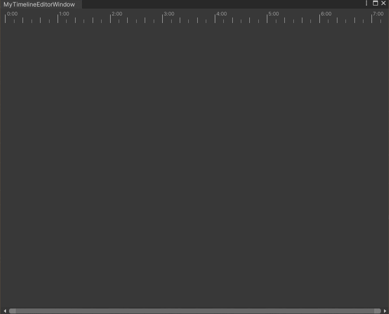

---

Unity编辑器源码中能找到很多有意思的代码，但是这些代码有很大一部分是`internal`或者`private`的，这让人很不爽。好东西为什么不放出来给大伙用呢？
为了用上这些玩意而不要自己重复造轮子，我尝试过用两种办法去搞这个事情：

## COPY大法

由于Unity的整个编辑器部分的代码是开源且托管在Github上的（<a href="https://github.com/Unity-Technologies/UnityCsReference/" target="_blank">代码地址点我</a>）那自然我需要什么就可以去取什么咯（这样好像违反了这代码仓库的许可证...）。这样做看起来很完美，但是当你无脑把代码copy过来的时候你会发现，你需要的代码A里大概率用到了代码B，而这个代码B又是一个被Unity藏起来不让你用的东西。你又得跑去仓库里copy代码B，然后你发现代码B里又用到了藏起来的代码C（其实这非常的废话，源码把这些代码藏起来的原因之一应该就是使用到了另一些藏起来的代码）。
如果藏起来的东西不多倒还可以短时间内通过一些乱七八糟的办法解决，但是如果很多的情况下，这样搞反而更糟心。

## 反射大法

第二种办法就是使用CSharp强大的反射功能，在反射面前，编辑器所有的代码仿佛全程裸奔无处遁形。我需要什么就反射什么，我反射什么就得到什么。
因为是编辑器代码，对性能要求没那么敏感，反射带来的额外开销完全可在承受范围之内。
为此，我整了一个抽象类用于表示反射出来的类，并且可以通过一些封装来实现COPY大法一样的使用方式，该类大体如下:

```csharp
public abstract class HackObjectBase
{
    protected Type _Type { get; private set; }
    protected object _Instance { get; private set; }

    private Dictionary<string, PropertyInfo> _properties = new();

    protected T GetProp<T>(string name)
    {
        if (!_properties.TryGetValue(name, out var info))
        {
            var t = _Type;
            while (t != null)
            {
                var prop = t.GetProperty(name, typeof(T));
                if (prop != null)
                {
                    _properties[name] = prop;
                    info = prop;
                    break;
                }

                t = t.BaseType;
            }
        }

        return (T)info.GetValue(_Instance);
    }

    protected void SetProp<T>(string name, T value)
    {
        if (!_properties.TryGetValue(name, out var info))
        {
            var t = _Type;
            while (t != null)
            {
                var prop = t.GetProperty(name, typeof(T));
                if (prop != null)
                {
                    _properties[name] = prop;
                    info = prop;
                    break;
                }

                t = t.BaseType;
            }          
        }

        info.SetValue(_Instance, value);
    }

    public bool IsValid => _Type != null && (IsStatic ? true : _Instance != null);
    public bool IsStatic => _Type != null && _Type.IsAbstract && _Type.IsSealed;

    public HackObjectBase(object instance)
    {
        _Type = instance.GetType();
        _Instance = instance;
    }

    public HackObjectBase(string asmStr, string clsName, params object[] args)
    {
        _Type = Assembly.Load(asmStr).GetType(clsName, true, false);

        if (_Type != null && !IsStatic)
        {
            _Instance = Activator.CreateInstance
            (
                _Type, 
                BindingFlags.Instance | BindingFlags.Public | BindingFlags.NonPublic, 
                null, 
                args, 
                null, 
                null
            );
        }
    }
}
```

这个类写的很粗糙，还可以通过更多的缓存`Member`、`Method`或者其他反射元数据来减少反射的性能消耗。

## 示例

最近在鼓捣游戏中的技能编辑器，想复用一下Unity中的`Animation`、`Timeline`和`CurveEditor`中的可缩放时间轴，查阅源码后发现这些玩意都使用到了`UnityEditor.TimeArea`这个结构，这个结构代码不多，而且也比较好看懂，虽然完全看懂后自己复刻一个难度也不大，但是我看懂后直接一个拿来主义岂不是更香（要不然为什么内置的都用它呢？）
为了整出这个类来，可以实现一个`HackTimeArea`类，这个类中有一个必须要用到的属性就是`hTicks`，这个表示时间轴上的动态刻度，所以得先把这个反射出来。

```csharp
[Serializable]
public class HackTickHandler : HackObjectBase
{
    public HackTickHandler() : base("UnityEditor.CoreModule", "UnityEditor.TickHandler") { }
    public HackTickHandler(object instance) : base(instance) { }

    public void SetTickModulosForFrameRate(float frameRate)
    {
        var method = _Type.GetMethod("SetTickModulosForFrameRate", new[] { typeof(float) });
        method.Invoke(_Instance, new object[] { frameRate });
    }

    public void SetShownHRange(float min, float max)
    {
        var method = _Type.GetMethod("SetShownHRange", new[] { typeof(float), typeof(float) });
        method.Invoke(_Instance, new object[] { min, max });
    }

}
```

由于基本只需要用到这两个函数，所以只反射这两个函数即可，反正有源码，对着源码写反射代码不要太容易。
之后可以把`HackTimeArea`也整出来，如下：

```csharp
[Serializable]
internal class HackTimeArea : HackObjectBase
{
    private HackTickHandler _hTicks = null;

    public HackTimeArea(bool minimalGUI) : base("UnityEditor.CoreModule", "UnityEditor.TimeArea", minimalGUI)
    {        
        var hTicks = _Type.GetProperty("hTicks");
        _hTicks = new(hTicks.GetValue(_Instance));
    }

    public Rect Rect
    {
        get => GetProp<Rect>("rect");
        set => SetProp("rect", value);
    }

    public bool HorizontalRangeLocked
    {
        get => GetProp<bool>("hRangeLocked");
        set => SetProp("hRangeLocked", value);
    }

    public bool VerticalRangeLocked
    {
        get => GetProp<bool>("vRangeLocked");
        set => SetProp("vRangeLocked", value);
    }

    public bool ScaleWithWindow
    {
        get => GetProp<bool>("scaleWithWindow");
        set => SetProp("scaleWithWindow", value);
    }

    public float Margin
    {
        get => GetProp<float>("margin");
        set => SetProp("margin", value);
    }

    public bool HorizontalSlider
    {
        get => GetProp<bool>("hSlider");
        set => SetProp("hSlider", value);
    }

    public bool VerticalSlider
    {
        get => GetProp<bool>("vSlider");
        set => SetProp("vSlider", value);
    }

    public float HorizontalBaseRangeMin
    {
        get => GetProp<float>("hBaseRangeMin");
        set => SetProp("hBaseRangeMin", value);
    }

    public float HorizontalBaseRangeMax
    {
        get => GetProp<float>("hBaseRangeMax");
        set => SetProp("hBaseRangeMax", value);
    }

    public float HorizontalRangeMin
    {
        get => GetProp<float>("hRangeMin");
        set => SetProp("hRangeMin", value);
    }

    public float HorizontalScaleMax
    {
        get => GetProp<float>("hScaleMax");
        set => SetProp("hScaleMax", value);
    }

    public HackTickHandler HorizontalTicks => _hTicks;

    public void BeginViewGUI()
    {
        var method = _Type.GetMethod("BeginViewGUI");
        method.Invoke(_Instance, null);
    }

    public void EndViewGUI()
    {
        var method = _Type.GetMethod("EndViewGUI");
        method.Invoke(_Instance, null);
    }

    public void TimeRuler(Rect position, float frameRate)
    {
        if (!IsValid)
            return;

        var method = _Type.GetMethod("TimeRuler", new[] { typeof(Rect), typeof(float) });
        method.Invoke(_Instance, new object[] { position, frameRate });
    }
}
```

当然这个类并不完整，仍然只写了我需要的那部分函数与属性之类的，但是这里的属性基本已经够用了。
之后便可以写一个测试窗口测试一下是否能够正常使用，该窗口代码如下：

```csharp
public class MyTimelineEditorWindow : EditorWindow
{
    [MenuItem("Tools/MyTimeline")]
    private static void Shown()
    {
        GetWindow<MyTimelineEditorWindow>().Show();
    }

    private HackTimeArea _timeArea = null;

    private void OnEnable()
    {
        if (_timeArea == null)
        {
            _timeArea = new(false)
            {
                HorizontalRangeLocked = false,
                VerticalRangeLocked = true,
                Margin = 10,
                ScaleWithWindow = true,
                HorizontalSlider = true,
                VerticalSlider = false,
                HorizontalBaseRangeMin = 0,
                HorizontalBaseRangeMax = 1f,
                HorizontalRangeMin = 0,
                HorizontalScaleMax = 90000f,
                Rect = position
            };
        }

        _timeArea.HorizontalTicks.SetTickModulosForFrameRate(30);
    }

    private void OnGUI()
    {
        _timeArea.Rect = new Rect(Vector2.zero, position.size);

        Rect rulerArea = _timeArea.Rect;
        rulerArea.height = 30f;

        _timeArea.BeginViewGUI();
        _timeArea.TimeRuler(rulerArea, 30);
        _timeArea.EndViewGUI();

    }
}
```

代码都写完了之后打开窗口看看，效果如下：

正常运行，完美~