---

本文主要讲述如何在UE5中设置布娃娃效果以及实现布娃娃状态下的起身动画，使用的引擎版本为UE5.7。
## 开启布娃娃效果
开启布娃娃的主要步骤就是开启骨骼网格中的物理模拟，为此需要把本来的胶囊碰撞体关闭，代码如下：

```cpp
void ToRagdoll()
{
    // 布娃娃状态下禁用移动
    GetCharacterMovement()->DisableMovement();
    // 关闭胶囊碰撞体
    GetCapsuleComponent()->SetCollisionEnabled(ECollisionEnabled::NoCollision);

    // 开启网格碰撞体并且设置网格物理模拟
    GetMesh()->SetCollisionEnabled(ECollisionEnabled::QueryAndPhysics);
    // 对某个根骨骼以下的所有骨骼启用物理模拟，一般为盆骨pelvis或者root
    GetMesh()->SetAllBodiesBelowSimulatePhysics(FName("pelvis"), true);
}
```

此外，要想使得布娃娃生效，必须提前配置好物理资产，此例中使用UE5.7第三人称模板中的物理资产`PA_Mannequin`。
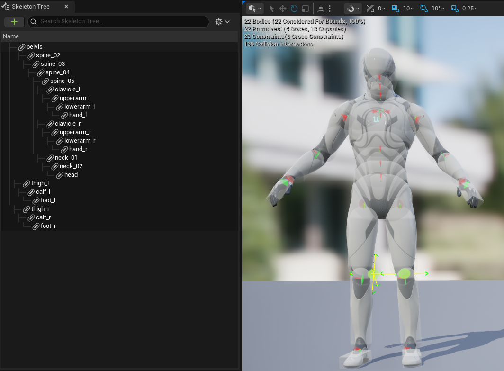
此时角色能够正确进入布娃娃状态：
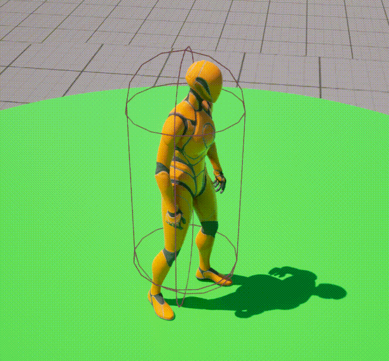

## 设置相机跟随

布娃娃效果开启后，`Mesh`组件由于物理模拟有可能位置会和`Capsule`有较大偏移量，这会导致传统的弹簧臂相机无法在开启布娃娃之后准确跟随，需要额外的操作使得相机能够正确跟随。
实现思路也颇为简单，在布娃娃状态下将胶囊体组件的位置实时更新到网格对应的位置即可。为此在角色上指定一个标记是否处于布娃娃状态的变量`bIsRagdoll`，在角色的`Tick`函数中同步这一变化。简单起见，此处将网格的`pelvis`骨骼位置定为布娃娃的位置。注意到胶囊体和网格的位置定义点并非在同一处，胶囊体存在一个`Capsule Half Height`属性，故这两个组件存在一个相对位置的偏移。
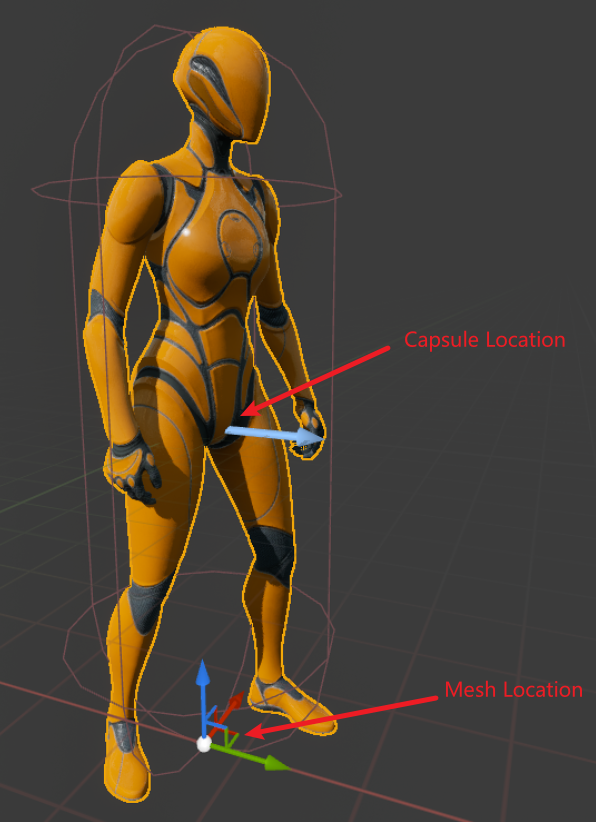
在更新`Capsule`位置时应考虑这个偏移量，最简单的办法是在`BeginPlay`函数中提前计算好这个偏移量，在每次更新的时候加进去即可。
此外，更新位置时，应该考虑角色与地面接触时的情形，简易处理办法为在布娃娃状态下，每帧朝地面方向执行一遍射线检测用于检测地面位置，在检测到地面之后，直接将`Capsule`定位到地面位置即可。
过程代码如下：

```cpp
void BeginPlay()
{
    Super::BeginPlay();

    // some others code
    ...

    DefaultMeshRelativeLocation = GetMesh()->GetRelativeLocation();
}

void Tick(float DeltaTime)
{
    // some others code
    ...

    if (bIsRagdoll)
    {
        auto SocketLocation = GetMesh()->GetSocketLocation(FName("pelvis"));
        // 使用100长度的射线向地面检测
        auto EndTracePoint = SocketLocation + FVector::DownVector * 100.f;

        FHitResult Hit;
        FVector GroundPoint = SocketLocation;
        if (UKismetSystemLibrary::LineTraceSingle(GetWorld(), SocketLocation, EndTracePoint, ETraceTypeQuery::TraceTypeQuery1, false, {}, EDrawDebugTrace::ForOneFrame, Hit, true))
        {
            GroundPoint = Hit.Location;
        }

        // 指定胶囊体的位置
        GetCapsuleComponent()->SetWorldLocation(GroundPoint - DefaultMeshRelativeLocation);
    }
}
```

至此，角色相机能够在布娃娃状态下正确跟随角色。

## 起身动画

理论上来说，要关闭布娃娃效果，只需要反向执行一遍进入布娃娃的设置即可。但是这样做会导致角色的状态变化过于突兀，显得非常不真实。故需要在这个过程中进行一个过渡效果，也即起身动画。
通过对需求分析，其原理应该如此：退出布娃娃效果 -> 播放一个从跌倒状态到起身的动画 -> 继续执行之后的动画。
看起来如此简单，那么实现上来说，最大的问题是如何去让这个起身看起来比较自然。
对大部分人形动画而言，起身只需要分成两种情况，即正面起身和背面起身。此处给出一个判断方式，仅供参考：
一般而言，对于人形角色的`pelvis`骨骼，其局部坐标在倒地状态下会发生改变，在**大多数情况下**人形角色倒地后会发生侧翻，此时观察角色倒地状态下的骨骼右向可以看到，当角色仰卧的时候，其右向量会有一个向上的分量，即`Z`轴大于0，而当角色俯卧的时候，其右向量有一个向下的分量。
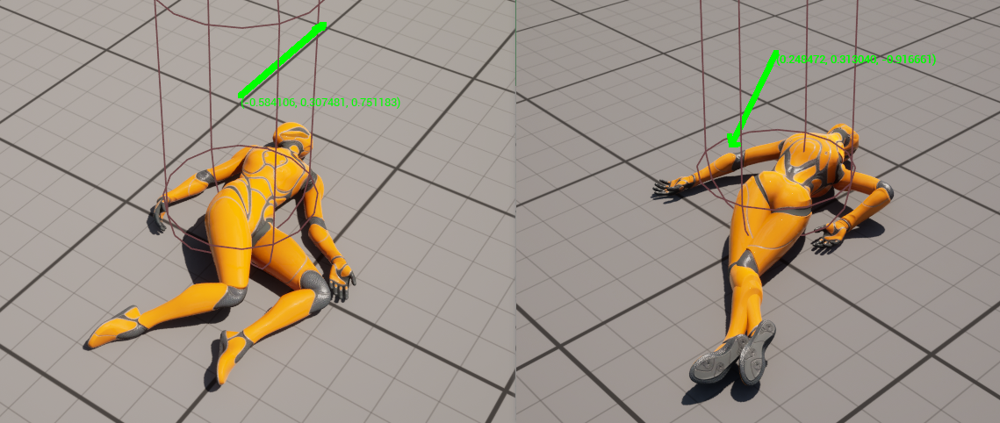
根绝此结论，可以快速得出一个判断角色倒地状态的函数，如下：

```cpp
bool ARagdollCharacter::IsRagdollFaceUp() const
{
    const auto PivotRotation = GetMesh()->GetSocketRotation(FName("pelvis"));
    const auto PivotRight = UKismetMathLibrary::GetRightVector(PivotRotation);

    return PivotRight.Z > 0;
}
```

有了这样一个基础判断，便可以更改角色的动画蓝图来控制动画了。
此处以第三人称模板的动画蓝图为例，说明如何添加这几种状态：
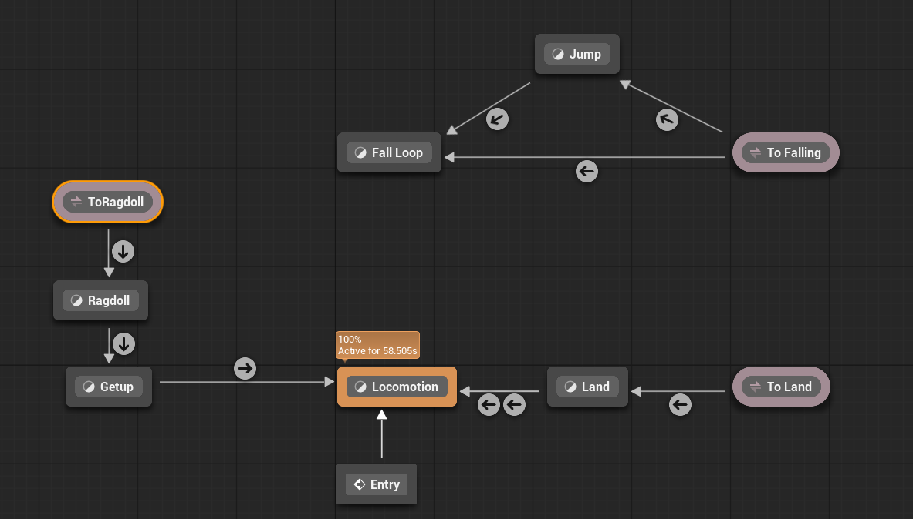
首先，新增两种状态`Ragdoll`和`Getup`来表示角色处于布娃娃以及起身的状态中，除这两种状态外，其他状态均可跳转到`Ragdoll`中，其跳转条件即为之前代码中规定的`bIsRagdoll`标记。
在`Ragdoll`状态，由于该状态下动画已经完全被物理接管，这里只需要随便设置一个姿势即可。
在`Getup`状态下，初始状态就是角色倒地的姿势，这个姿势可以通过`AnimInstance`中的`SavePoseSnapshot`函数来确定，规定一个通用的快照名，在ABP和角色逻辑中均使用此名称即可。之后通过判断是否脸朝上来切换到不同的动画片段，如下：
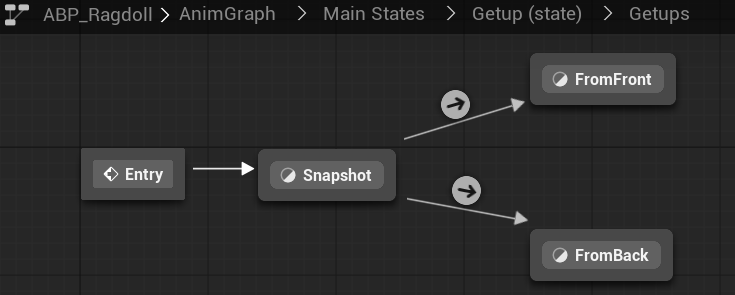
对ABP的改动重点就是这样，回到逻辑代码中还有两个问题需要解决，一是起身的时候需要先同步下胶囊体的位置，同时记录下当前姿势的快照。二是如何确定起身动画已经完成了呢？
先说同步方向，为什么要同步方向呢？因为`Mesh`在物理控制下发生了对应的变化，其朝向大概率已经发生了转变。而`Capsule`却并没有发生变化，此时如果不同步位置就切换布娃娃，则朝向会发生突变导致不自然的结果，故需要先将胶囊体转到与`Mesh`相同方向再进行后续行为。
这里分享一个简易办法，仅供参考：仍然以大多数人形动画为例，取其`neck`骨骼与`pelvis`骨骼的位置，以从`pelvis`指向`neck`的方向作为角色的朝向，从而将胶囊体转向此方向，注意此处亦要区分布娃娃的脸部朝向，代码如下：

```cpp
void SetCapsuleOrientation()
{
    // use neck - pelvis for x direction
    const auto NeckPosition = GetMesh()->GetSocketLocation(FName(TEXT("neck_01")));
    const auto PelvisPosition = GetMesh()->GetSocketLocation(FName(TEXT("pelvis")));

    const auto Direction = NeckPosition - PelvisPosition;
    // check face direction to set rotation
    const auto Rotation = UKismetMathLibrary::MakeRotFromZX(FVector::UpVector, IsRagdollFaceUp() ? -1 * Direction : Direction);

    GetCapsuleComponent()->SetWorldRotation(Rotation);
}
```

之后便是恢复角色的动画状态，其操作与进入布娃娃状态基本相反，如下：

```cpp
void ResetRagdoll()
{
    // save snapshot to define name
    GetMesh()->GetAnimInstance()->SavePoseSnapshot(RagdollSnapshotName);

    GetMesh()->SetAllBodiesSimulatePhysics(false);
    GetMesh()->SetCollisionEnabled(ECollisionEnabled::QueryOnly);
    GetCapsuleComponent()->SetCollisionEnabled(ECollisionEnabled::QueryAndPhysics);

    bIsRagdoll = false;
}
```

由于布娃娃完全由物理控制，故为了保证旋转完全同步，在设置旋转之后我们最好能够延迟两帧再进行后续操作，至此解决了第一个问题。
第二个问题则应该放在动画中去解决，在起身动画中可以指定一个`Notify`来通知是否结束，如下所示：
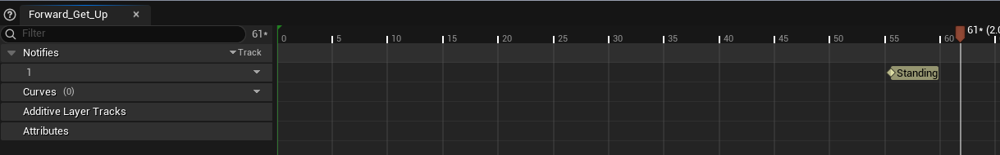
在ABP中便可以使用`Was Anim Notify Name Triggered in Any State`节点来判断是否该切换到下一个动画状态：
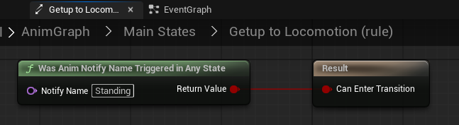
同时还能通过事件来通知到角色以进行后续处理（这里的操作也可以反过来通知到角色再通过角色通知到ABP）：
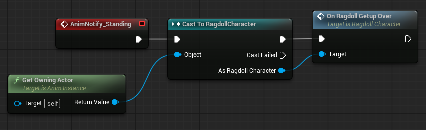
至此，起身动画的流程结束，角色已经可以在平地上正常进入布娃娃状态以及退出布娃娃状态了。
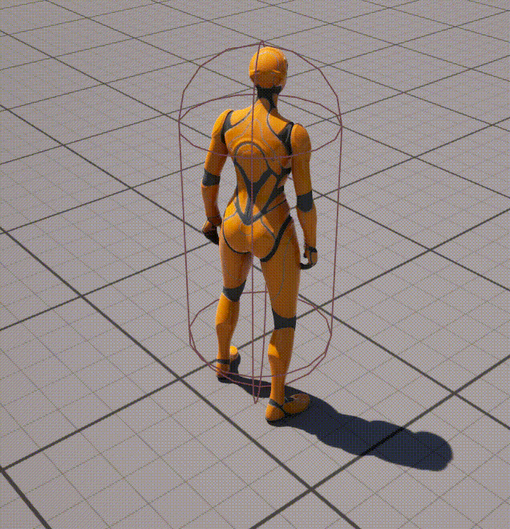

## 适配IK

做到这一步还不够，如果此时角色在斜坡上退出布娃娃状态，则会出现起身的过程中双脚位置由于受到IK影响而出现鬼畜的情况。
为了解决这一问题，可以在脚本中设置一个标记为标记角色是否应该启用IK，默认为`true`，在进入布娃娃之后置为`false`，并且在前文提到的起身结束后再度置为`true`。
ABP中同步此变量并且在最后的融合阶段中根据此标记来确定是否执行`Control Rig`节点，此操作可通过`Blend Poses by Bool`来实现，即ABP如下：
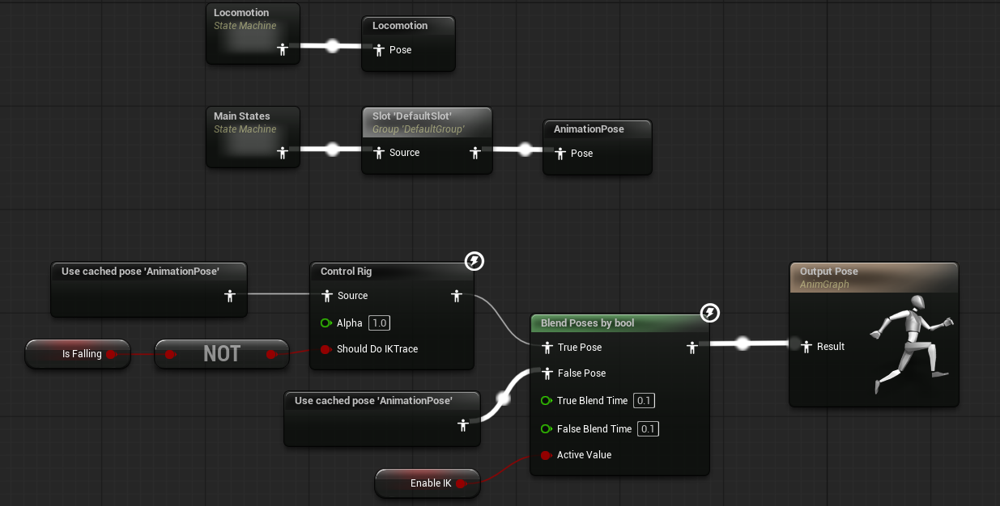

## 总结

经过这一系列操作之后，便可以实现在UE中启用和退出布娃娃状态，并且在斜坡上也有正确的IK表现：
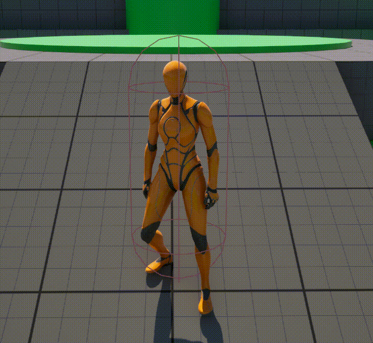

## 参考资料

> [Ragdolling and how to recover from it](https://dev.epicgames.com/community/learning/tutorials/mvvL/unreal-engine-ragdolling-and-how-to-recover-from-it)